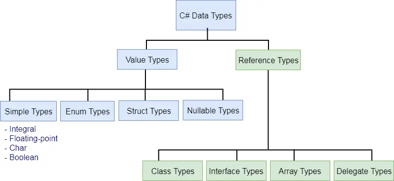
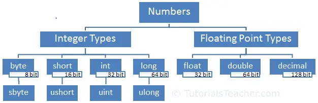

# Day 2

Day 2 Topic(s) is / are:

- Variables
- Data types
- Data types conversion
- String concatenation and interpolation
- Printing output
- User input into variables

```
Pro-Tip/ Shortcuts for VS:

Ctrl + L : remove current line
Ctrl + D : Duplicate current line
Ctrl + K + C : comment block
Ctrl + K + U : uncomment block
Ctrl + K + D : fix formatting
Shift + Alt + Enter : focus mode
Ctrl + M + M : expand/ collapse block
Ctrl + M + O : expand/ collapse to definition
Ctrl + R + M : extracts (refactors a bunch of codes) to method
Ctrl + K + S : Surrounds the block of code
Ctrl + R + R : rename method/ variable all the way
Ctrl + R + G : organizes using references
Ctrl + Enter : Add a line above
Ctrl + Shift + Enter : Add a line below
F12 : go to definition
Shift + F12 : find all references
ctor + Tab + Tab : generate constructor
foreach + Tab + Tab : generate foreach loop
for + Tab + Tab : generate for loop
sw + Tab + Tab : generate switch statement
Alt + up / down : Move line (selected block) up/ down
```

## Variables:
A variable stores a value of the specific data type.
Syntax: 

```
<data-type> <variable_name> = <value>;
int num = 100;
```

The followings are naming conventions for declaring variables in C#:
1. Variable names must be unique.
2. Variable names can contain letters, digits, and the underscore _ only.
3. Variable names must start with a letter.
4. Variable names are case -sensitive, num and Num are considered different names.
5. Variable names cannot contain reserved keywords. Must prefix @ before keyword if want reserve keywords as identifiers.

C# is a strongly-typed language. It means we must declare the type of a variable that indicates the kind of values it is going to store, such as integer, float, decimal, text, etc.

Variables can be declared and initialized together (initialization).

Variables can be declared first and initialized later (late initialization).

The value of a variable can be changed anytime after initializing it.

Multiple variables of the same data type can be declared and initialized in a single line separated by commas. 
Multiple variables of the same type can also be declared in multiple lines separated by a comma. The compiler will consider it to be one statement until it encounters a semicolon **;**.

The value of a variable can be assigned to another variable of the same data type. However, a value must be assigned to a variable before using it.

**Implicitly-typed variables:**
C# 3.0 introduced var keyword to declare method level variables without specifying a data type explicitly.

Syntax: 

```
var <variable_name> = <value>;
var num = 100; //compiler will auto-understand variable num as an integer type
```

**Implicitly-typed variables must be initialized at the time of declaration**; otherwise C# compiler would give an error: Implicitly-typed variables must be initialized.

Multiple declarations of var variables in a single statement are **not** allowed.

var **cannot** be used for function parameters.

var **can** be used in for, and foreach loops.

var **can** also be used with LINQ queries.


## Data-types:
C# mainly categorized data types in two types: **Value** types and **Reference** types.
**Value** types include simple types (such as int, float, bool, and char), enum types, struct types, and nullable value types.
**Reference** types include class types, interface types, delegate types, and array types.



**Predefined Data Types in C#:**
C# includes some predefined value types and reference types. The following table lists predefined data types:

| Type | Description | Range | Suffix |
|:---|:---|:---|:---|
| byte | 8 - bit unsigned integer | 0 to 255 |  |
| sbyte | 8 - bit signed integer | -128 to 127 |  |
| short | 16 - bit signed integer | -32,768 to 32,767 |  |
| ushort | 16 - bit unsigned integer | 0 to 65,535 |  |
| int | 32 - bit signed integer | -2,147,483,648 to 2,147,483,647 |  |
| uint | 32 - bit unsigned integer | 0 to 4,294,967,295 | u | |
| long | 64 - bit signed integer | -9,223,372,036,854,775,808 to 9,223,372,036,854,775,807 | l |
| ulong | 64 - bit unsigned integer | 0 to 18,446,744,073,709,551,615 | ul |
| float | 32 - bit Single - precision floating point type | -3.402823e38 to 3.402823e38 | f |
| double | 64 - bit double-precision floating point type | -1.79769313486232e308 to 1.79769313486232e308 | d |
| decimal | 128 - bit decimal type for financial and monetary calculations | (+or -)1.0 x 10e-28 to 7.9 x 10e28 | m |
| char | 16 - bit single Unicode character | Any valid character, e.g.a, *, \x0058(hex), or\u0058(Unicode)  |  |
| bool | 8 - bit logical true / false value | True or False  | |
| object | Base type of all other types |  |  |
| string | A sequence of Unicode characters |  |  |
| DateTime | Represents date and time | 0:00:00am 1 / 1 / 01 to 11:59:59pm 12 / 31 / 9999 |  |

**Alias vs .NET Type:**
The predefined data types are alias to their .NET type(CLR class) name.The following table lists alias for predefined data types and related.NET class name.

| Alias | .NET Type | Type |
|:---|:---|:---|
| byte | System.Byte | struct |
| sbyte | System.SByte | struct |
| int | System.Int32 | struct |
| uint | System.UInt32 | struct |
| short | System.Int16 | struct |
| ushort | System.UInt16 | struct |
| long | System.Int64 | struct |
| ulong | System.UInt64 | struct |
| float | System.Single | struct |
| double | System.Double | struct |
| char | System.Char | struct |
| bool | System.Boolean | struct |
| object | System.Object | Class |
| string | System.String | Class |
| decimal | System.Decimal | struct |
| DateTime | System.DateTime | struct |

### Numbers in C#:
Numbers, in general, can be divided into two types: **Integer** type and **floating-point** types.



**Integer** type numbers are whole numbers without decimal points. It can be negative or positive numbers. **Integer** type numbers are positive or negative whole numbers without decimal points. C# includes four data types for integer numbers: byte, short, int, and long.

**Floating-point** type is numbers with one or more decimal points. It can be negative or positive numbers. **Floating-point** numbers are positive or negative numbers with one or more decimal points. C# includes three data types for floating-point numbers: float, double, and decimal.

### C# Strings:
In C#, a string is a series of characters that is used to represent text. It can be a character, a word or a long passage surrounded with the double quotes ".

C# includes escaping character **\** (backslash) before special characters to include in a string.

Verbatim string can be created by prefixing **@** symbol before double quotes.

### DateTime:
C# includes DateTime struct to work with dates and times.

**Ticks** is a date and time expressed in the number of 100-nanosecond intervals that have elapsed since January 1, 0001, at 00:00:00.000 in the Gregorian calendar.

The DateTime struct includes static fields, properties, and methods.

**TimeSpan** is a struct that is used to represent time in days, hour, minutes, seconds, and milliseconds. Subtraction of two dates results in TimeSpan.

The DateTime struct overloads +, -, ==, !=, >, <, <=, >= operators to ease out addition, subtraction, and comparison of dates. These make it easy to work with dates.

## Data-type conversions:
The values of certain data types are automatically converted to different data types in C#. This is called an implicit conversion.

However, not all data types are implicitly converted to other data types. It must be specified explicitly.

## String Concatenation:
Multiple strings can be concatenated with **+** operator.

## String Interpolation: 
String interpolation is a better way of concatenating strings. We use + sign to concatenate string variables with static strings.

C# 6 includes a special character $ to identify an interpolated string. An interpolated string is a mixture of static string and string variable where string variables should be in {} brackets.

